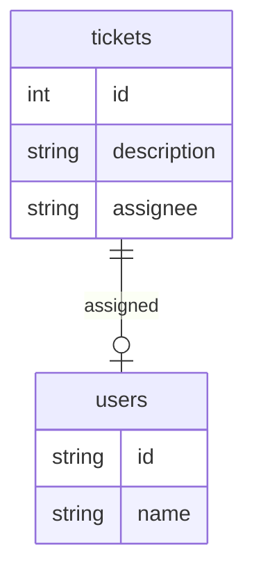

<!-- markdownlint-disable MD046 -->
import SideBySideContainer from '@site/src/components/SideBySide/Container';
import SideBySideColumn from '@site/src/components/SideBySide/Column';


# Data Filters Testing

There are two approaches to testing data filter policies using EOPA:

1. **Effects**-based tests: testing the **effects of filters against sample data**
2. **Code**-based tests: testing the **compiled filters as code**


:::tip
All approaches explained in this section **include the fragment checks** outlined in [Writing valid data filtering policies](fragment).

Invalid data filtering policies will be reported in the `eopa test` run.
:::


## Example Preamble

In our running example, we'll assume two tables: `tickets` with columns `id` (number), `description` and `assignee`; and table `users` with columns `id` (string) and `name`.
These **unknown values** are represented with `input.<TABLE>.<COLUMN>` e.g. `input.users.name`




## Filter Effects Testing

EOPA provides a helper method for testing the _effect of data filtering_ on provided data: the `filter.helper()` built-in function provided via `data.system.eopa.utils.tests.v1.filter`

In the following Rego files, we have the filter rules, and a set of unit tests using those helpers:

import Tabs from '@theme/Tabs';
import TabItem from '@theme/TabItem';

<Tabs>

<TabItem value="test" label="filters_test.rego">
  ```rego name=filters_test.rego showLineNumbers
    package filters

	import data.system.eopa.utils.tests.v1.filter

	tickets_table := [
		{"id": 0, "description": "bluetooth icon is green", "assignee": "a"},
		{"id": 1, "description": "yellow pages are purple", "assignee": "a"},
		{"id": 2, "description": "bluegrass sounds orange", "assignee": "b"},
	]

	users_table := [
		{"id": "a", "name": "jane"},
		{"id": "b", "name": "john"},
	]

	test_assignee_can_see_their_tickets if {
		filtered := filter.helper(
			"data.filters.include",
			"SELECT tickets.description, users.name as assignee FROM tickets LEFT JOIN users ON tickets.assignee = users.id",
			{
				"tickets": tickets_table,
				"users": users_table,
			},
			{},
		) with input.username as "jane"
		count(filtered) == 2
		{"description": "bluetooth icon is green", "assignee": "jane"} in filtered
		{"description": "yellow pages are purple", "assignee": "jane"} in filtered
	}
	```
</TabItem>
<TabItem value="policy" label="filters.rego">
  <!-- markdownlint-disable MD022 MD023 -->
    ```rego name=filters.rego showLineNumbers=17
    package filters

    # METADATA
    # scope: document
    # custom:
    #   unknowns: ["input.tickets", "input.users"]
    include if input.users.name == input.username
    ```
  <!-- markdownlint-enable MD022 MD023 -->
</TabItem>
</Tabs>


### Filter Helper

Let's walk through our invocation of `filter.helper()`. The full options and description are available in the [`filter.helper()` reference documentation](../reference/built-in-functions/filter-helper.md).


#### Filter Rule

```rego showLineNumbers=17
filtered := filter.helper(
		# highlight-next-line
		"data.filters.include",
		...
```
The first argument to `data.system.eopa.utils.tests.v1.filter.helper()` is the reference of the rule used for data filtering, `data.filters.include`, as defined in `filters.rego`.


#### SQL Query

```rego showLineNumbers=17
filtered := filter.helper(
		...,
		# highlight-next-line
		"SELECT tickets.description, users.name as assignee FROM tickets LEFT JOIN users ON tickets.assignee = users.id",
		...
```

The second argument is the _query_,

```sql
SELECT
  tickets.description,
  users.name as assignee
FROM tickets
LEFT JOIN users ON tickets.assignee = users.id
```
which _ties together_ the  two sample tables, `tickets_table` and `users_table`:

<SideBySideContainer>
  <SideBySideColumn>
    <h3>`tickets_table`</h3>
id | description | assignee
---|---|---
0 | bluetooth icon is green | a
1 | yellow pages are purple | a
2 | bluegrass sounds orange | b
  </SideBySideColumn>
  <SideBySideColumn>
    <h3>`users_table`</h3>
id | name
---|---
a  | jane
b  | john
  </SideBySideColumn>
</SideBySideContainer>


#### Table Mappings to Sample Data

```rego showLineNumbers=17
filtered := filter.helper(
		...,
		...,
		# highlight-start
		{
			"tickets": tickets_table,
			"users": users_table,
		},
		# highlight-end
		...
```

Third we provide the mappings of table names to sample data.


#### Input Overrides

```rego showLineNumbers=25
# highlight-next-line
) with input.username as "jane"
```

Finally, the _input_ used for the unit test is provided via `with` overriding


### Assertions

Assertions are ordinary Rego expressions against the returned array of objects (`filtered`):

```rego showLineNumbers=26
count(filtered) == 2
{"description": "bluetooth icon is green", "assignee": "jane"} in filtered
{"description": "yellow pages are purple", "assignee": "jane"} in filtered
```

Everything available in Rego can be put to use here, for example:

```rego
every row in filtered {
	row.assignee == "jane"
}
```

When running `eopa test filters.rego filters_test.rego`, we get this:

```interactive
$ eopa test filters.rego filters_test.rego
PASS: 1/1
```


### Failure Modes


#### Failed Assertions

Data filtering unit tests are just unit tests.
If your assertions fail to hold, you'll see the well-known output for test failures.

For example, if we wrote this assertion,

```rego name=filters_fail_test.rego
test_assignee_can_see_their_tickets if {
	filtered := filter.helper(
		"data.filters.include",
		"SELECT tickets.description, users.name as assignee FROM tickets LEFT JOIN users ON tickets.assignee = users.id",
		{
			"tickets": tickets_table,
			"users": users_table,
		},
		{},
	) with input.username as "jane"
	# diff-remove
	count(filtered) == 2
	# diff-add
	count(filtered) == 3
	{"description": "bluetooth icon is green", "assignee": "jane"} in filtered
	{"description": "yellow pages are purple", "assignee": "jane"} in filtered
}
```

this is what we'd see:

```interactive
$ eopa test filters.rego filters_fail_test.rego
filters_fail_test.rego:
data.filters.test_assignee_can_see_their_tickets: FAIL (5.04575ms)
--------------------------------------------------------------------------------
FAIL: 1/1
```

To get a better understanding what goes on under the hood of the test helper, we can enable "debug" mode:

```rego
	filtered := filter.helper(
		"data.filters.include",
		"SELECT tickets.description, users.name as assignee FROM tickets LEFT JOIN users ON tickets.assignee = users.id",
		{
			"tickets": tickets_table,
			"users": users_table,
		},
		# diff-remove
		{},
		# diff-add-start
		{
			"debug": true,
		},
		# diff-add-end
	) with input.username as "jane"
```

and re-run our tests:

```interactive
$ eopa test filters.rego filters_fail_test.rego
filters_fail_test.rego:
data.filters.test_assignee_can_see_their_tickets: FAIL (3.931083ms)

  executing query CREATE TABLE tickets (assignee ANY, description ANY, id ANY) against :memory:
  executing query INSERT INTO tickets (assignee, description, id) VALUES ('a', 'bluetooth icon is green', 0) RETURNING * against :memory:
  executing query INSERT INTO tickets (assignee, description, id) VALUES ('a', 'yellow pages are purple', 1) RETURNING * against :memory:
  executing query INSERT INTO tickets (assignee, description, id) VALUES ('b', 'bluegrass sounds orange', 2) RETURNING * against :memory:
  executing query CREATE TABLE users (id ANY, name ANY) against :memory:
  executing query INSERT INTO users (id, name) VALUES ('a', 'jane') RETURNING * against :memory:
  executing query INSERT INTO users (id, name) VALUES ('b', 'john') RETURNING * against :memory:
  rego.compile response: {"query": "WHERE users.name = 'jane'"}
  executing query SELECT tickets.description, users.name as assignee FROM tickets LEFT JOIN users ON tickets.assignee = users.id WHERE users.name = 'jane' against :memory:
  list response: [{"assignee": "jane", "description": "bluetooth icon is green"}, {"assignee": "jane", "description": "yellow pages are purple"}]
  executing query DROP TABLE tickets against :memory:
  executing query DROP TABLE users against :memory:

--------------------------------------------------------------------------------
FAIL: 1/1
```

Note that **debug output** doesn't appear on successful tests.


#### Fragment violations

If our filter policy contains a construct that [isn't valid](fragment), `eopa test` will inform us about that in our unit tests.

For example, let's slightly change the rule in `filters.rego`:


```rego name=filters.rego
package filters

# METADATA
# scope: document
# custom:
#   unknowns: ["input.tickets", "input.users"]
# diff-remove
include if input.users.name == input.username
# diff-add-start
include if input.users.name == username

username := object.get(input, "username", "<unknown>")
# diff-add-end
```

our test output will become:

```interactive
$ eopa test filters.rego filters_test.rego
filters_test.rego:
data.filters.test_assignee_can_see_their_tickets: ERROR (2.923291ms)
  1 error occurred during compilation:
filters.rego:9: pe_fragment_error: eq: nested call operand: object.get(input, "username", "<unknown>")
--------------------------------------------------------------------------------
ERROR: 1/1
```


### Peek under the hood

How does it all work?
The test helper creates the provided tables in an in-memory SQLite database,
uses `rego.compile()` ([see below](#filter-code-testing)) to compile the data filtering policy into SQL where clauses,
and uses the provided query together with those clauses in [`sql.send()`](../../../enterprise-opa/reference/built-in-functions/sql) to produce the filtered array of objects.

If you want to manually explore the database tables that are created by the helper, pass the file name via the "db" key, like

```rego
	filtered := filter.helper(
		"data.filters.include",
		"SELECT tickets.description, users.name as assignee FROM tickets LEFT JOIN users ON tickets.assignee = users.id",
		{
			"tickets": tickets_table,
			"users": users_table,
		},
		# diff-remove
		{},
		# diff-add-start
		{
			"db": "tmp.sqlite",
		},
		# diff-add-end
	) with input.username as "jane"
```

:::warning
When a custom database file name is provided like this, the helper will **not** drop tables at the end of a test run,
allowing you to inspect the intermediate state of your database after `eopa test` has run.

However, this means that a subsequent run will not start with a fresh database.
It is up to the user to **remove the temporary database file between runs**.
:::


## Filter Code Testing

Instead of writing assertions against filtered sample data, we can instead directly test the filter code that's generated from compiling a filter rule.

Reusing `filters.rego` from [above](#filter-effects-testing), we can have a different kind of test:

```rego name=filters_lowlevel_test.rego
package filters

test_generated_where_clause if {
	conditions := rego.compile({
		"query": "data.filters.include",
		"target": "sql+postgresql",
	}) with input.username as "jane"
	conditions.query == "WHERE users.name = E'jane'"
}
```

Running these tests, we find:

```interactive
$ eopa test filters.rego filters_lowlevel_test.rego
PASS: 1/1
```

See the [`rego.compile()` built-in function reference documentation](../reference/built-in-functions/rego-compile.md) for further details.


### Failure modes


#### Assertions

For a more complex example, let's add a condition to `data.filters.include`:

```rego name=filters.rego
package filters

# METADATA
# scope: document
# custom:
#   unknowns: ["input.tickets", "input.users"]
include if input.users.name == input.username

# diff-add
include if contains(input.tickets.description, input.query)
```

and update our test inputs, but not our assertions,

```rego name=filters_lowlevel_test.rego
package filters

test_generated_where_clause if {
	conditions := rego.compile({
		"query": "data.filters.include",
		"target": "sql+postgresql",
	}) with input.username as "jane"
		# diff-add
		with input.query as "orange"
	conditions.query == "WHERE users.name = E'jane'"
}
```

so our test run fails:

```interactive
$ eopa test filters.rego filters_lowlevel_test.rego
data.filters.test_generated_where_clause: FAIL (568.5µs)
--------------------------------------------------------------------------------
FAIL: 1/1
```

This is the ordinary test assertion failure behavior of `eopa test`.
To get some more insights, let's add a `print()`:

```rego name=filters_lowlevel_test.rego
package filters

test_generated_where_clause if {
	conditions := rego.compile({
		"query": "data.filters.include",
		"target": "sql+postgresql",
	}) with input.username as "jane"
		with input.query as "orange"
	# diff-add
	print(conditions)
	conditions.query == "WHERE users.name = E'jane'"
}
```

Now our output becomes:

```interactive
$ eopa test filters.rego filters_lowlevel_test.rego
data.filters.test_generated_where_clause: FAIL (647.584µs)

  {"query": "WHERE (users.name = E'jane' OR tickets.description LIKE E'%orange%')"}

--------------------------------------------------------------------------------
FAIL: 1/1
```

Knowing the generated SQL, it's straightforward to adjust our assertions:

```rego name=filters_lowlevel_test.rego
package filters

test_generated_where_clause if {
	conditions := rego.compile({
		"query": "data.filters.include",
		"target": "sql+postgresql",
	}) with input.username as "jane"
		with input.query as "orange"
	# diff-remove
	print(conditions)
	# diff-remove
	conditions.query == "WHERE users.name = E'jane'"
	# diff-add
	conditions.query == "WHERE (users.name = E'jane' OR tickets.description LIKE E'%orange%')"
}
```

And with this change, our low-level test succeeds:


```interactive
$ eopa test filters.rego filters_lowlevel_test.rego
PASS: 1/1
```


#### Fragment violations

Let's again change our filter policy to contain a construct that [isn't valid](fragment).
`eopa test` will inform us about that in our low-level unit tests, too.

For example, let's again slightly change the rule in `filters.rego`:

```rego name=filters.rego
package filters

# METADATA
# scope: document
# custom:
#   unknowns: ["input.tickets", "input.users"]
# diff-remove
include if input.users.name == input.username
# diff-add-start
include if input.users.name == username

username := object.get(input, "username", "<unknown>")
# diff-add-end
```

and re-run the low-level tests:


```interactive
$ eopa test filters.rego filters_lowlevel_test.rego
data.filters.test_generated_where_clause: ERROR (526.875µs)
  1 error occurred during compilation:
filters.rego:9: pe_fragment_error: eq: nested call operand: object.get(input, "username", "<unknown>")
--------------------------------------------------------------------------------
ERROR: 1/1
```
