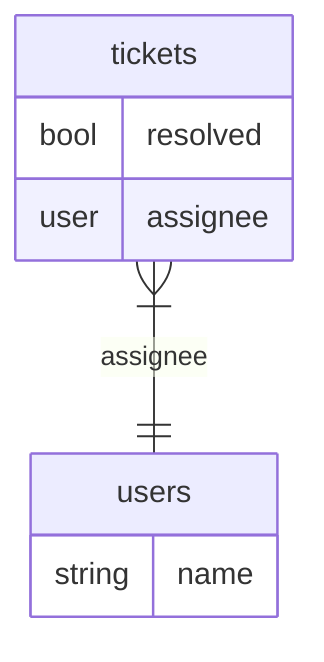
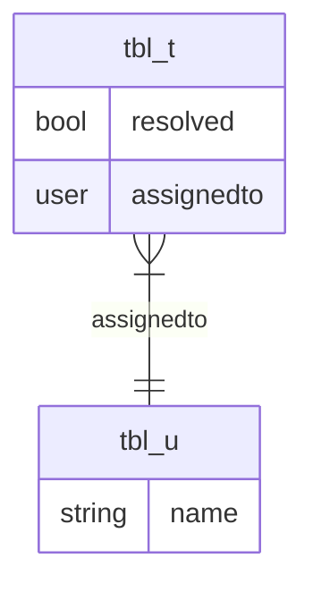

<!-- markdownlint-disable MD046 -->

# Data Filters Compilation API

Creating data filters and optional column masks from Rego policies in Enterprise OPA uses an expanded version of the Open Policy Agent `/v1/compile` API[<sup>1</sup>](#external-reference).


## Generate Filters and Column Masks


```http
POST /v1/compile/{path}
Content-Type: application/json
Accept: ...
```

Where the `{path}` is the slash delimited filter rule to be compiled. E.g., to compile the `data.filters.include` rule, query `/v1/compile/filters/include`


### Request Headers

| Name | Required | Accepted Values | Description |
| --- | --- | --- | --- |
| Content-Type | Yes | `application/json`<br /><br />`application/x-yaml` | Indicates the request body is either a JSON or YAML encoded document. |
| Content-Encoding | No | gzip | Indicates the request body is a compressed gzip object. |
| Accept | Yes | See [below](#accept-header--controlling-the-target-response-format) | See [below](#accept-header--controlling-the-target-response-format) |


### Accept Header – Controlling the Target Response Format

The same request can generate filters that are representable in many different ways, such as raw SQL `WHERE` clauses or [Universal Conditions AST](/apps/data/reference/ucast-syntax).

Enterprise OPA uses the `Accept` header to denote the target response format.

| Value | Response Schema | Description |
| --- | --- | -- |
| Rego AST: `application/json` | `result.queries[]` | The default behavior of Open Policy Agent. Response format is JSON in Rego AST |
| Multitarget: `application/vnd.styra.multitarget+json` | `result.{ucast,sqlserver,mysql,postgresql,sqlite}` | The partially evaluated result of the query in each target dialect. Use the [`options.targetDialects`](#request-body) field in the request body to control targets. |
| UCAST: `application/vnd.styra.ucast.all+json`, `application/vnd.styra.ucast.minimal+json`, `application/vnd.styra.ucast.linq+json`, `application/vnd.styra.ucast.prisma+json` | `result.query`| UCAST JSON object describing the conditions under which the query is true. |
| SQL: `application/vnd.styra.sql.sqlserver+json`, `application/vnd.styra.sql.mysql+json`, `application/vnd.styra.sql.postgresql+json`, `application/vnd.styra.sql.sqlite+json` | `result.query`| String representing the SQL equivalent of the conditions under which the query is true. |


### Request Body

| Field | Type | Required | Description |
| --- | --- | --- | --- |
| `input` | `any` | No | The input document to use during partial evaluation and during mask rule evaluation (default: undefined). |
| `options` | `object[string, any]` | No | Additional options to use during partial evaluation |
| `options.disableInlining` | `array[string]` | No. Default: undefined | A list of rule references. |
| `options.maskRule` | `string` | No | The rule to evaluate for generating column masks. Overrides any `mask_rule` annotations defined in the policy. |
| `options.nondeterminsticBuiltins` | `bool` | No. Default: `false`. If using any target other than Rego AST, it is **always `true`** | When `false`, non-deterministic built-in functions are kept in the PE results, without being partially evaluated. |
| `options.targetDialects` | `array[string]`, one of `ucast+all`, `ucast+minimal`, `ucast+prisma`, `ucast+linq`, `sql+sqlserver`, `sql+mysql`, `sql+postgresql` | Yes, if using `multitarget`. **Ignored for all other targets** | The output targets for partial evaluation. Different targets will have different constraints. Use [`Accept` header](#accept-header--controlling-the-target-response-format) to request a single compilation target.  |
| `options.targetSQLTableMappings` | `object[string, object[string, string]]` | No | A mapping between tables and columns. See the [example](#using-table-and-column-remappings) for the schema. |
| `unknowns` | `array[string]` | No | The terms to treat as unknown during partial evaluation (default: `["input"]`]). |


### Query Parameters

See the Open Policy Agent `/v1/compile` API[<sup>1</sup>](#external-reference)


### SQL Examples

In this support ticket application example, the list of tickets a user can see is determined by their role.

Roles are provided to Enterprise OPA via `roles/data.json`, and the SQL tables contain tickets and assignees.



import Tabs from '@theme/Tabs';
import TabItem from '@theme/TabItem';

<Tabs>
    <TabItem value="rego" label="filters.rego" default>
    ```rego
    package filters

    import rego.v1

    # Include in results if
    # User has the "admin" role.
    include if {
        "admin" in data.roles[input.user]
    }

    # Include in results if
    # User has the "reader" role, and the ticket is assigned to them.
    include if {
        "reader" in data.roles[input.user]

        # Name field on Users table == the current user.
        # input.<table>.<column>
        input.users.name == input.user
    }

    # Include in results if
    # User has the "resolver" role, and the ticket is assigned to them.
    include if {
        "resolver" in data.roles[input.user]

        # ticket is assigned to user
        input.users.name == input.user
    }

    # Include in results if
    # User has the "resolver" role, and the ticket is unassigned and unresolved.
    include if {
        "resolver" in data.roles[input.user]

        # ticket is unassigned and unresolved
        input.tickets.assignee == null
        input.tickets.resolved == false
    }

    # Mask all ticket IDs by default.
    default masks.tickets.id.replace.value := "<id>"

    # Allow viewing the ID if the user is an admin.
    masks.tickets.id.replace.value := {} if {
      "admin" in data.roles[input.tenant][input.user]
    }
    ```

    </TabItem>
    <TabItem value="data" label="roles/data.json">
    ```rego
    {
      "alice": ["admin"],
      "bob": ["reader"],
      "ceasar": ["resolver"]
    }
    ```
    </TabItem>
</Tabs>


#### Admin

As an Admin, I can view every ticket.

:::note No filter means show all
Note that the filter returned is **empty**, which implies "show all". In UCAST this is represented with a `{}`, and with SQL strings, this is `""`.
For column masks, an empty column masking function is represented with a `{}`, and implies "show value".
:::


##### Request

<Tabs groupId="admin">
<TabItem value="ucast" label="UCAST">
    ```http
    POST /v1/compile/filters/include
    Content-Type: application/json
    Accept: application/vnd.styra.ucast.all+json

    {
      "input": {
        "user": "alice",
        "action": "list"
      },
      "unknowns": [
        "input.tickets",
        "input.users"
      ]
    }
    ```
</TabItem>
<TabItem value="postgresql" label="PostgreSQL">
    ```http
    POST /v1/compile/filters/include
    Content-Type: application/json
    Accept: application/vnd.styra.sql.postgresql+json

    {
      "input": {
        "user": "alice",
        "action": "list"
      },
      "unknowns": [
        "input.tickets",
        "input.users"
      ]
    }
    ```
</TabItem>
</Tabs>


##### Response

<Tabs groupId="admin">
<TabItem value="ucast" label="UCAST">
    ```http
    HTTP/1.1 200 OK
    Content-Type: application/json

    {
      "result": {
        "query": {}
      }
    }
    ```
</TabItem>
<TabItem value="postgresql" label="PostgreSQL">
    ```http
    HTTP/1.1 200 OK
    Content-Type: application/json

    {
      "result": {
        "query": ""
      }
    }
    ```
</TabItem>
</Tabs>


#### Reader

As a Reader, I can only see tickets that I am assigned to.


##### Request

<Tabs groupId="reader">
<TabItem value="ucast" label="UCAST">
    ```http
    POST /v1/compile/filters/include
    Content-Type: application/json
    Accept: application/vnd.styra.ucast.prisma+json

    {
      "input": {
        "user": "bob",
        "action": "list"
      },
      "unknowns": [
        "input.tickets",
        "input.users"
      ]
    }
    ```
</TabItem>
<TabItem value="postgresql" label="PostgreSQL">
    ```http
    POST /v1/compile/filters/include
    Content-Type: application/json
    Accept: application/vnd.styra.sql.postgresql+json

    {
      "input": {
        "user": "bob",
        "action": "list"
      },
      "unknowns": [
        "input.tickets",
        "input.users"
      ]
    }
    ```
</TabItem>
</Tabs>


##### Response

<Tabs groupId="reader">
<TabItem value="ucast" label="UCAST">
    ```http
    HTTP/1.1 200 OK
    Content-Type: application/json

    {
      "result": {
        "query": {
          "type": "field",
          "operator": "eq",
          "field": "users.name",
          "value": "bob"
        }
      }
    }
    ```
</TabItem>
<TabItem value="postgresql" label="PostgreSQL">
    ```http
    HTTP/1.1 200 OK
    Content-Type: application/json

    {
      "result": {
        "query": "WHERE users.name = E'bob'"
      }
    }
    ```
</TabItem>
</Tabs>


#### Resolver (using Multitarget)

As a Resolver, I can see either tickets I'm assigned to, or tickets that are unassigned and unresolved


##### Request

<Tabs groupId="resolver">
<TabItem value="multitarget" label="Multitarget: UCAST + PostgreSQL">
    ```http
    POST /v1/compile/filters/include
    Content-Type: application/json
    Accept: application/vnd.styra.multitarget+json

    {
      "input": {
        "user": "ceasar",
        "action": "list"
      },
      "unknowns": [
        "input.tickets",
        "input.users"
      ],
      "options": {
        "targetDialects": [
          "ucast+prisma",
          "sql+postgresql"
        ]
      }
    }
    ```
</TabItem>
</Tabs>


##### Response

<Tabs groupId="resolver">
<TabItem value="multitarget" label="Multitarget: UCAST + PostgreSQL">
    ```http
    HTTP/1.1 200 OK
    Content-Type: application/json

    {
      "result": {
        "ucast": {
          "query": {
            "type": "compound",
            "operator": "or",
            "value": [
              {
                "type": "field",
                "operator": "eq",
                "field": "users.name",
                "value": "ceasar"
              },
              {
                "type": "compound",
                "operator": "and",
                "value": [
                  {
                    "type": "field",
                    "operator": "eq",
                    "field": "tickets.assignee",
                    "value": null
                  },
                  {
                    "type": "field",
                    "operator": "eq",
                    "field": "tickets.resolved",
                    "value": false
                  }
                ]
              }
            ]
          }
        },
        "postgresql": {
          "query": "WHERE (users.name = E'ceasar' OR (tickets.assignee IS NULL AND tickets.resolved = FALSE))"
        }
      }
    }
    ```
</TabItem>
</Tabs>


#### Using Table and Column Remappings

In this example, we'll imagine the same scenario as above but the SQL schema is as follows:



The tickets table is now `tbl_t` and the users table is now `tbl_u`, and the `assignee` joined field is now named `assignedto`.


##### Request

<Tabs groupId="resolver">
<TabItem value="multitarget" label="Multitarget: UCAST + PostgreSQL">
    ```http
    POST /v1/compile/filters/include
    Content-Type: application/json
    Accept: application/vnd.styra.multitarget+json

    {
      "input": {
        "user": "ceasar",
        "action": "list"
      },
      "unknowns": [
        "input.tickets",
        "input.users"
      ],
      "options": {
        "targetDialects": [
          "ucast+prisma",
          "sql+postgresql"
        ],
        "targetSQLTableMappings": {
          "postgresql": {
            "users": {
              "$self": "tbl_u"
            },
            "tickets": {
              "$self": "tbl_t",
              "assignee": "assignedto"
            },
          "ucast": {
            "users": {
              "$self": "tbl_u"
            },
            "tickets": {
              "$self": "tbl_t",
              "assignee": "assignedto"
            }
          }
        }
      }
    }
    ```
</TabItem>
</Tabs>


##### Response

<Tabs groupId="resolver">
<TabItem value="multitarget" label="Multitarget: UCAST + PostgreSQL">
    ```http
    HTTP/1.1 200 OK
    Content-Type: application/json

    {
      "result": {
        "ucast": {
          "query": {
            "type": "compound",
            "operator": "or",
            "value": [
              {
                "type": "field",
                "operator": "eq",
                "field": "tbl_u.name",
                "value": "ceasar"
              },
              {
                "type": "compound",
                "operator": "and",
                "value": [
                  {
                    "type": "field",
                    "operator": "eq",
                    "field": "tbl_t.assignedto",
                    "value": null
                  },
                  {
                    "type": "field",
                    "operator": "eq",
                    "field": "tbl_t.resolved",
                    "value": false
                  }
                ]
              }
            ]
          }
        },
        "postgresql": {
          "query": "WHERE (tbl_u.name = E'ceasar' OR (tbl_t.assignedto IS NULL AND tbl_t.resolved = FALSE))"
        }
      }
    }
    ```
</TabItem>
</Tabs>


### Generate Column Masks

Once the right rows have been selected, some columns may still contain sensitive data that a user is not allowed to view.
Column masks allow modifying or replacing that data before the user sees it.


#### Using Column Masks

In this example, we'll be reusing the original database setup, with `tickets` and `users` tables.

The key difference this time around will be plumbing in column masking for hiding the `tickets.id` field from all non-admin roles.
Column masking rules use the same `input` as data filtering rules, but are evaluated directly by Enterprise OPA, with no special partial evaluation or compilation steps.


#### Admin (with column masking)

As before, an admin should be able to view every ticket, _and_ should be able to see the restricted `tickets.id` field.

:::note Policies can designate their column masking rules
In this example, we are manually selecting the column masking rule to use with `options.maskRule`.
However, we could also have selected that rule with a metadata field. See the Mask rule reference !!![TODO: Cross-link]!!!
:::


##### Request

<Tabs groupId="admin">
<TabItem value="ucast" label="UCAST">
    ```http
    POST /v1/compile
    Content-Type: application/json
    Accept: application/vnd.styra.ucast.all+json

    {
      "query": "data.filters.include",
      "input": {
        "user": "alice",
        "action": "list"
      },
      "unknowns": [
        "input.tickets",
        "input.users"
      ],
      "options": {
        "maskRule": "data.filters.masks"
      }
    }
    ```
</TabItem>
<TabItem value="postgresql" label="PostgreSQL">
    ```http
    POST /v1/compile
    Content-Type: application/json
    Accept: application/vnd.styra.sql.postgresql+json

    {
      "query": "data.filters.include",
      "input": {
        "user": "alice",
        "action": "list"
      },
      "unknowns": [
        "input.tickets",
        "input.users"
      ],
      "options": {
        "maskRule": "data.filters.masks"
      }
    }
    ```
</TabItem>
</Tabs>


##### Response

<Tabs groupId="admin">
<TabItem value="ucast" label="UCAST">
    ```http
    HTTP/1.1 200 OK
    Content-Type: application/json

    {
      "result": {
        "query": {},
        "masks": {}
      }
    }
    ```
</TabItem>
<TabItem value="postgresql" label="PostgreSQL">
    ```http
    HTTP/1.1 200 OK
    Content-Type: application/json

    {
      "result": {
        "query": "",
        "masks": {}
      }
    }
    ```
</TabItem>
</Tabs>


#### Reader (with column masking)

As before, Readers should only be able to see tickets they are assigned to, but now we'll also restrict the ticket IDs.


##### Request

<Tabs groupId="reader">
<TabItem value="ucast" label="UCAST">
    ```http
    POST /v1/compile
    Content-Type: application/json
    Accept: application/vnd.styra.ucast.prisma+json

    {
      "query": "data.filters.include",
      "input": {
        "user": "bob",
        "action": "list"
      },
      "unknowns": [
        "input.tickets",
        "input.users"
      ],
      "options": {
        "maskRule": "data.filters.masks"
      }
    }
    ```
</TabItem>
<TabItem value="postgresql" label="PostgreSQL">
    ```http
    POST /v1/compile
    Content-Type: application/json
    Accept: application/vnd.styra.sql.postgresql+json

    {
      "query": "data.filters.include",
      "input": {
        "user": "bob",
        "action": "list"
      },
      "unknowns": [
        "input.tickets",
        "input.users"
      ],
      "options": {
        "maskRule": "data.filters.masks"
      }
    }
    ```
</TabItem>
</Tabs>


##### Response

<Tabs groupId="reader">
<TabItem value="ucast" label="UCAST">
    ```http
    HTTP/1.1 200 OK
    Content-Type: application/json

    {
      "result": {
        "query": {
          "type": "field",
          "operator": "eq",
          "field": "users.name",
          "value": "bob"
        },
        "masks": {
          "tickets": {
            "id": {
              "replace": {
                "value": "<id>"
              }
            }
          }
        }
      }
    }
    ```
</TabItem>
<TabItem value="postgresql" label="PostgreSQL">
    ```http
    HTTP/1.1 200 OK
    Content-Type: application/json

    {
      "result": {
        "query": "WHERE users.name = E'bob'",
        "masks": {
          "tickets": {
            "id": {
              "replace": {
                "value": "<id>"
              }
            }
          }
        }
      }
    }
    ```
</TabItem>
</Tabs>


## External Reference

1. [Open Policy Agent Compile API](https://www.openpolicyagent.org/docs/rest-api/#compile-api)
1. [Universal Conditions AST Syntax](/apps/data/reference/ucast-syntax)

