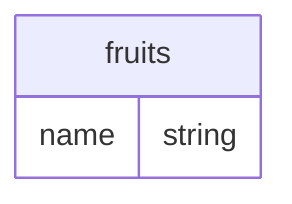

The `rego.compile()` built-in function allows you to programatically [generate data filters and column masks](../api-reference/partial-evaluation-api.md) from Rego rules.

The function partially evaluates a filter rule, checking that the rule is [valid](/apps/data/explanation/testing), and consequently compiling it into the desired output syntax, such as SQL strings or [UCAST](/apps/data/reference/ucast-syntax).
It also evaluates any paired column masking rule, and will include the results in the output.

:::warning
`rego.compile()` is intended for use in testing ([see here for examples](/apps/data/explanation/testing)), and it is therefore only available in `eopa test` and `eopa eval`.
:::


## `rego.compile`


### Example Usage

```rego
rego.compile({
  "query": "data.filters.include",
  "target": "sql+postgresql",
}) with input.username as "jane"
```


### Parameters

| Parameter | Type | Required (default) | Description |
| --- | --- | --- | --- |
| `query` | String | Yes | The query to partially evaluate, e.g. `data.filters.include`. |
| `target` | String | Yes. One of `sql+mysql`, `sql+postgresql`, `sql+sqlserver` | The target for query translation. |
| `mappings` | Object | No (`{}`) | Table and column name mappings for query translation (see below). |
| `raise_error` | Bool | No (`true`)| If set to false, translation-related errors are returned as an object with key `error`. |


### Mappings

Mappings allow you to rename fields during query compilation.

Below we will be reusing an example featuring a `fruits` table with a column `name`



When writing rules **without mappings**, `input.<table_name>.<col_name>` expressions are directly translated into SQL clauses.

A rego expression of `input.fruits.name = "banana"` would generate a SQL filter of

```sql
WHERE fruits.name = E'banana'
```


#### Renaming tables and columns

Using the same example expression as above, `input.fruits.name` could be adjusted to yield a constraint like
```sql
WHERE FRUIT.NAME = E'banana'
```

by passing a mapping object like this:
```json
{
  "postgresql": {
    "fruits": {
      "$self": "FRUIT",
      "name": "NAME"
    }
  }
}
```


#### Renaming short references to tables

Furthermore, mappings enable the translation of short references, so an expression like `input.name = "banana"` could become a query like

```sql
WHERE fruits.name = E'banana'
```

by passing a mapping object like this:
```json
{
  "postgresql": {
    "name": {
      "$table": "fruits",
    }
  }
}
```


#### Renaming short references to columns

If need be, we can also translate the column name of a short reference, so an expression like `input.label = "banana"` could become a query like:

```sql
WHERE fruits.name = E'banana'
```

by passing a mapping object like this:
```json
{
  "postgresql": {
    "label": {
      "$table": "fruits"
    }
    "fruits": {
      "label": "name"
    }
  }
}
```
