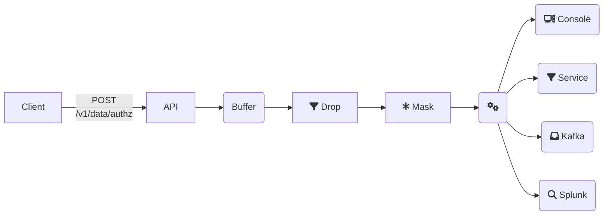

<!-- TODO: Split into "to Kafka", "to Splunk" tutorials -->

Every policy evaluation requested by an API client leads to a decision log entry.
In EOPA, these decision logs are handled differently from OPA:

1. Multiple, and new, sinks are available.
2. Buffering is configurable.


## Overview

In this tutorial we'll be walking through how to use EOPA's decision
log enhancements -- we will demonstrate how to send decision logs to

- the console,
- a Kafka topic,
- an HTTP Service, and
- Splunk

simultaneously. This might be too much for realistic use cases, but
gives us chance to try most of the various available options.


## Configuration

To enable all those decision log sinks, use the following config:

```yaml
# eopa.yml
services:
- name: dl
  url: http://127.0.0.1:4195/post
decision_logs:
  plugin: eopa_dl
  drop_decision: /demo/drop
  mask_decision: /demo/mask
plugins:
  eopa_dl:
    buffer:
      type: memory
    output:
    - type: console
    - type: service
      service: dl
    - type: kafka
      urls:
      - 127.0.0.1:9092
      topic: logs
    - type: splunk
      url: https://$SPLUNKHOST/services/collector/event
      token: $SPLUNK_TOKEN
      batching:
        at_period: 3s
        compress: true
      tls:
        skip_cert_verify: true
```

Architecturally, this is what we've set up here:





### Sinks

One-by-one, this is what's set up for outputs:
1. Console output. This is the same as OPA's stock decision log output,
   the decision logs are printed on standard output.
2. Service output. Compatible with your existing OPA service config, the
   decision log entries are sent in the same format, gzipped, and combined
   into a JSON array.
3. Kafka output. All decision log entries will be emitted as JSON messages
   in the configured topic.
4. Splunk output. All entries become Splunk evens sent to the configured
   [HTTP Event Collector](https://docs.splunk.com/Documentation/Splunk/9.0.4/RESTREF/RESTinput#services.2Fcollector).


## Demonstration

Create a file called `docker-compose.yaml` and insert the following configuration:

```yaml
# docker-compose.yml
version: "3.9"

services:
  kafka:
    image: bitnami/kafka:latest
    ports:
      - "9091:9091"
      - "9092:9092"
    environment:
      - BITNAMI_DEBUG=yes
      - KAFKA_BROKER_ID=1
      - KAFKA_CFG_NODE_ID=1
      - KAFKA_ENABLE_KRAFT=yes
      - KAFKA_CFG_PROCESS_ROLES=broker,controller
      - KAFKA_CFG_CONTROLLER_LISTENER_NAMES=CONTROLLER
      - KAFKA_CFG_AUTO_CREATE_TOPICS_ENABLE=true
      - KAFKA_CFG_LISTENERS=INTERNAL://kafka:9091,EXTERNAL://:9092,CONTROLLER://:9093
      - KAFKA_CFG_LISTENER_SECURITY_PROTOCOL_MAP=CONTROLLER:PLAINTEXT,EXTERNAL:PLAINTEXT,INTERNAL:PLAINTEXT
      - KAFKA_CFG_ADVERTISED_LISTENERS=EXTERNAL://127.0.0.1:9092,INTERNAL://kafka:9091
      - KAFKA_CFG_INTER_BROKER_LISTENER_NAME=INTERNAL
      - KAFKA_CFG_CONTROLLER_QUORUM_VOTERS=1@127.0.0.1:9093
      - ALLOW_PLAINTEXT_LISTENER=yes
    healthcheck:
      test: ["CMD-SHELL", "kafka-topics.sh --bootstrap-server kafka:9091 --topic logs --create --if-not-exists"]
      interval: 2s
      timeout: 2s
      retries: 15

  dl-sink:
    image: jeffail/benthos:latest
    ports:
      - "4195:4195"
    volumes:
      -  "./benthos-dl.yml:/benthos.yaml"
  kafka-log:
    image: edenhill/kcat:1.7.1
    command: "-C -b kafka:9091 -t logs -E"
    depends_on:
      kafka:
        condition: service_healthy
```

Let's also use a policy:
```rego
# policy.rego
package authz

import rego.v1

default allow := false

# users can update their own records
allow if {
	path := split(input.path, "/")
	path[1] == "data"
	path[2] == input.username
	input.method == "POST"
}

# users can read all records
allow if {
	path := split(input.path, "/")
	path[1] == "data"
	input.method == "GET"
}
```

With the EOPA configuration above, and with a license set up properly, we can run
EOPA via `eopa run --config-file eopa.yml --server policy.rego`.

To start up some auxiliary services, notably Apache Kafka and an HTTP sink,
use  `docker compose up` with the provided `docker-compose.yml` file.

:::note
If you don't have a Splunk instance at hand, you can replace the `url` of the
Splunk output in the configuration example with `http://127.0.0.1:4195/post/logs`
and you will see the Splunk-ready payload in that service's console logs.
:::

Next, we will observe that sending a simple requests to EOPA's HTTP API
will now lead to the following:

1. The HTTP service `dl-sink` will receive the decision log,
2. The `kafka-log` process that consumes the `logs` topic of the started
   Apache Kafka instance will also output this log.
3. There well be an event sent to Splunk.

But first, the API request triggering a policy evaluation:
```json
# terminal-command
curl "http://127.0.0.1:8181/v1/data/authz?pretty" -d '{"input": {"path": "/data/fruits", "method": "GET"}}'
{
  "result": {
    "allow": true
  }
}
```

The HTTP service sports this output:

```json
{
  "decision_id": "955ee45b-8624-4e23-af67-e3513d69c997",
  "input": {
    "method": "GET",
    "path": "/data/fruits"
  },
  "labels": {
    "id": "6067027a-caf0-4601-8691-6a1ba0906b4b",
    "type": "eopa",
    "version": "0.52.0"
  },
  "metrics": {
    "counter_regovm_eval_instructions": 42,
    "counter_server_query_cache_hit": 1,
    "timer_rego_input_parse_ns": 17637,
    "timer_regovm_eval_ns": 73731,
    "timer_server_handler_ns": 110230
  },
  "nd_builtin_cache": {},
  "path": "authz",
  "req_id": 4,
  "requested_by": "127.0.0.1:61318",
  "result": {
    "allow": true
  },
  "timestamp": "2023-05-12T13:36:37.496602+02:00"
}
```

which is exactly the same as we can find published on the Kafka topic,
and on the running EOPA service's standard output.

The payload sent to the Splunk endpoint is what that endpoint expects,
e.g.
```json
{
  "event": {
    "decision_id": "955ee45b-8624-4e23-af67-e3513d69c997",
    "input": {
      "method": "GET",
      "path": "/data/fruits"
    },
    "labels": {
      "id": "6067027a-caf0-4601-8691-6a1ba0906b4b",
      "type": "eopa",
      "version": "0.52.0"
    },
    "metrics": {
      "counter_regovm_eval_instructions": 42,
      "counter_server_query_cache_hit": 1,
      "timer_rego_input_parse_ns": 17637,
      "timer_regovm_eval_ns": 73731,
      "timer_server_handler_ns": 110230
    },
    "nd_builtin_cache": {},
    "path": "authz",
    "req_id": 4,
    "requested_by": "127.0.0.1:61318",
    "result": {
      "allow": true
    },
    "timestamp": "2023-05-12T13:36:37.496602+02:00"
  },
  "time": 1683891397
}
```

The event's fields can all be used for searching and filtering via Splunk's
services.


## Further Reading

- Please see the [reference documentation for all details](/eopa/reference/configuration/decision-logs).
- The files used in the examples are also available in the EOPA [blueprints repo](https://github.com/open-policy-agent/eopa/tree/main/examples/decision-logs).
- Documentation about the used Splunk Endpoint can be found here: [HTTP Event Collector](https://docs.splunk.com/Documentation/Splunk/9.0.4/RESTREF/RESTinput#services.2Fcollector).
