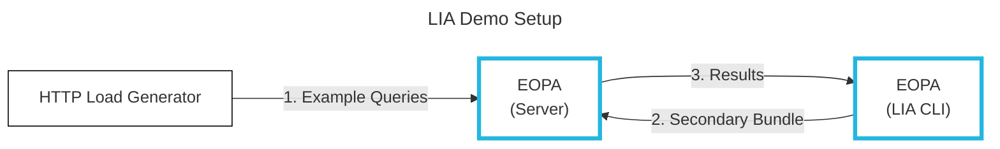

Live Impact Analysis (LIA) is a feature of EOPA which
allows you to preview the impact of changes to policy code before deploying.
LIA works by sampling live traffic and comparing the results from the new
policy against the currently deployed policy.


## Overview

In this tutorial we'll be walking through the LIA feature with an example policy.
We will send sample traffic to EOPA and use LIA to compare the results from two versions of a policy.

Our demo architecture looks like this:




This tutorial will consist of the following steps:

- Installation of prerequisites
- Configuration of LIA and policy for use in EOPA
- Configuring and sending sample traffic
- Running the Live Impact Analysis and reviewing the results

Our load generator will send a series of queries to EOPA.
Next we'll use the EOPA CLI to kick off a LIA run with a new policy.
This will output some results we can review to make sure our policy change is working as expected.


## Installing Prerequisites

Please ensure that you have the following installed before continuing.

- [EOPA](/eopa/how-to/install/local) - installed and [licensed](/eopa/how-to/run/with-a-license).
  We'll be running EOPA locally for this demo but the process for running LIA against a remote deployment is much the same.
- [Benthos](https://www.benthos.dev/docs/guides/getting_started#install) - an open source stream generator and processor.
  We'll be using this for traffic generation in our demo, but it'll likely be useful for your own testing too.


## Configure Live Impact Analysis

EOPA doesn't enable LIA by default, so we need to configure it.
The feature can be configured using the configuration file example below.

```yaml
# config.yaml
plugins:
  impact_analysis: {}
```

Save this code in a file called `config.yaml`.

LIA doesn't need any additional configuration on the server side as LIA runs are triggered and configured from the CLI.


# Creating a Policy

We're going to be using an example policy where users are allowed to perform certain actions on a dataset.
The desired behavior is:

- Users can update their own data
- All users can read all data

This policy in Rego looks like this:

```rego
# policy.rego
package authz

import rego.v1

default allow := false

# users can update their own records
allow if {
	path := split(input.path, "/")
	path[1] == "data"
	path[2] == input.username
	input.method == "POST"
}

# users can read all records
allow if {
	path := split(input.path, "/")
	path[1] == "data"
	input.method == "GET"
}
```

Save this policy as `policy.rego`.


## Running EOPA

Run EOPA in server mode with the following command, specifying our configuration file and Rego policy.

```shell
# terminal-command
eopa run -s -c config.yaml policy.rego
```


# Configure and Send Sample Traffic

We're going to be using Benthos (which we installed earlier) to send sample traffic to EOPA.
Benthos is a general purpose tool, so we need to configure it for our use case.
We need our requests to have `path`, `method` and `username` fields like this:

```json
{
  "path": "/data/$USER",
  "method": "POST or GET",
  "username": "$USER"
}
```

We can use a Benthos config file to generate the requests we need and send them to our running EOPA server every 10ms.

```yaml
# benthos.yaml
input:
  generate:
    mapping: |
      root.input.username = match random_int(seed:timestamp_unix_nano(), max:2) {
        0 => "alice",
        1 => "admin",
        2 => "tester",
      }
      root.input.path = match random_int(seed:timestamp_unix_nano(), max:2) {
        0 => "/data/alice",
        1 => "/data/tester",
        2 => "/data",
      }
      root.input.method = match random_int(seed:timestamp_unix_nano(), max:2) {
        0 => "GET",
        1 => "POST",
        2 => "DELETE",
      }
    interval: 10ms
output:
  http_client:
    url: "http://localhost:8181/v1/data/authz/allow"
    verb: POST
```

Save this config as `benthos.yaml` and, in another terminal run:

```shell
# terminal-command
benthos -c benthos.yaml
```

:::note
It'd be simple to update this Benthos config to target a remote EOPA instance, should your use case require it.
Using [`kubectl port-forward`](https://kubernetes.io/docs/tasks/access-application-cluster/port-forward-access-application-cluster/)
is a quick way to do this for an instance without a public URL.
:::


## Run Live Impact Analysis

In order to see LIA in action, we need to make a change to our policy to compare the results.

The change we'd like to make is that 'testers' can now delete their data - in addition to updating it.
We can do this by appending the following rule to our policy:

```rego
# policy.rego

...

# user 'tester' can delete their own data
allow if {
	path := split(input.path, "/")
	path[1] == "data"
	path[2] == "tester"
	input.method == "DELETE"
	input.username == "tester"
}
```

Now we need to build our policy to be sent to the EOPA instance for LIA.
The LIA command will send a policy bundle to the server for comparison:
We can create one like this:

```shell
# terminal-command
eopa build -b .
```

Now that we have a bundle, we can start the LIA job. Here we set some configuration as command flags:

- `--bundle` - the new policy bundle we want to test
- `--duration` - how long we want to run the LIA test for
- `--sample-rate` - what percentage of traffic we want to sample, 0.0 to 1.0
- `--group` - group the results by input and path

Let's have a look at the 'raw' results showing a comparison of the old and new policies.
Here we can see that the tester's previously denied `DELETE` operations, are now allowed (`false` -> `true`).

```shell
# terminal-command
eopa impact record --bundle bundle.tar.gz --duration 2s --sample-rate 1
┌───────────────────────────────────────┬──────────────┬─────────┬─────────┬─────────────────────────────────────────────────────────────────┬──────────────┬─────────────────┬─────────────────┐
│                node_id                │    req_id    │ value_a │ value_b │                              input                              │     path     │ eval_duration_a │ eval_duration_b │
├───────────────────────────────────────┼──────────────┼─────────┼─────────┼─────────────────────────────────────────────────────────────────┼──────────────┼─────────────────┼─────────────────┤
│  f5fa7b6a-2032-49b7-9776-c67bf2d797fd │ 1.911342e+06 │   false │    true │ {"method":"DELETE","path":"\/data\/tester","username":"tester"} │  authz/allow │        11.375µs │        20.208µs │
...
│  f5fa7b6a-2032-49b7-9776-c67bf2d797fd │ 1.911467e+06 │   false │    true │ {"method":"DELETE","path":"\/data\/tester","username":"tester"} │  authz/allow │        10.417µs │        17.834µs │
└───────────────────────────────────────┴──────────────┴─────────┴─────────┴─────────────────────────────────────────────────────────────────┴──────────────┴─────────────────┴─────────────────┘
```

Sometimes it can be overwhelming to look at all the raw data at once.
In such cases, we can use the `--group` flag to summarize results which we might want to review.
Each 'group' is represented as a row containing statistics for a given `path` and `input` pair.

For each pair, we are shown the count of matching requests (`n`) and the [descriptive statistics](https://en.wikipedia.org/wiki/Descriptive_statistics) for both the current (primary) and new (secondary) policies.
The following statistics are shown to support your comparisons: `mean`, `median`, `min`, `max`, `stddev` (standard deviation) and `variance`.

```shell
# terminal-command
eopa impact record --bundle bundle.tar.gz --duration 2s --sample-rate 1 --group
┌──────────────┬─────────────────────────────────────────────────────────────────┬───┬───────────────────────┬─────────────────────────┬──────────────────────┬──────────────────────┬─────────────────────────┬──────────────────────┬─────────────────────────┬───────────────────────────┬────────────────────────┬────────────────────────┬───────────────────────────┬────────────────────────┐
│     path     │                              input                              │ n │ mean_primary_duration │ median_primary_duration │ min_primary_duration │ max_primary_duration │ stddev_primary_duration │ var_primary_duration │ mean_secondary_duration │ median_secondary_duration │ min_secondary_duration │ max_secondary_duration │ stddev_secondary_duration │ var_secondary_duration │
├──────────────┼─────────────────────────────────────────────────────────────────┼───┼───────────────────────┼─────────────────────────┼──────────────────────┼──────────────────────┼─────────────────────────┼──────────────────────┼─────────────────────────┼───────────────────────────┼────────────────────────┼────────────────────────┼───────────────────────────┼────────────────────────┤
│  authz/allow │ {"method":"DELETE","path":"\/data\/tester","username":"tester"} │ 9 │              17.541µs │                17.209µs │                9.5µs │             25.083µs │                 6.383µs │          40.750743ms │                19.537µs │                  18.875µs │               17.083µs │               22.834µs │                   1.944µs │             3.779526ms │
└──────────────┴─────────────────────────────────────────────────────────────────┴───┴───────────────────────┴─────────────────────────┴──────────────────────┴──────────────────────┴─────────────────────────┴──────────────────────┴─────────────────────────┴───────────────────────────┴────────────────────────┴────────────────────────┴───────────────────────────┴────────────────────────┘
```

In this case, all the results are as we'd expect.
The tester's new permissions are allowing their `DELETE` operations through making the new policy safe to roll out.
CSV and JSON output formats are also available should you need to perform some further analysis of the results.

:::info
It's worth noting that the return values are not shown when using the `--group` flag.
If your policies return different values for the same input you might want to review the raw results too.
:::


## Further Reading

Please refer to the following resources for more information.

- Find the code from this tutorial [on GitHub](https://github.com/StyraInc/eopa/tree/main/examples/live-impact-analysis).
- Watch a LIA demo [on YouTube](https://www.youtube.com/watch?v=MV9vhQCElkE).
- Read about impact [policy testing](/das/policies/policy-authoring/test-policies) in Styra DAS.

:::caution Compatibility
Live Impact Analysis is currently limited to policies and data contained in the bundle provided by the client. If you want to run LIA against policies that depend on dynamically injected data (e.g., from the Kafka plugin) please [contact us](mailto:devrel@styra.com)
:::
